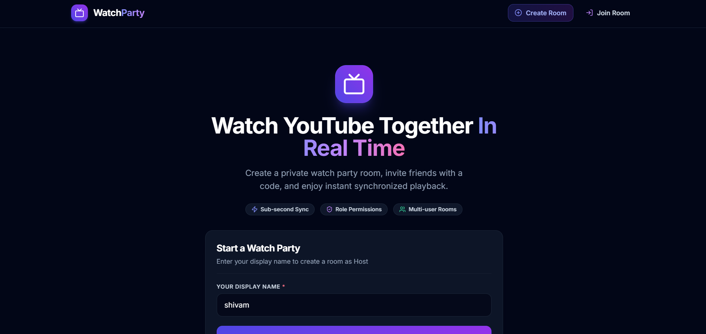
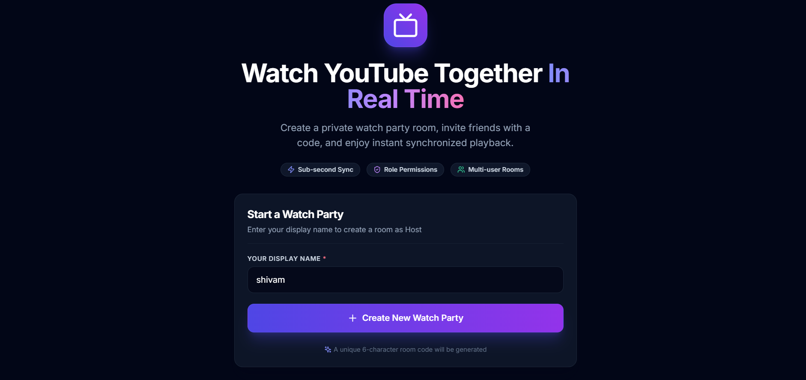
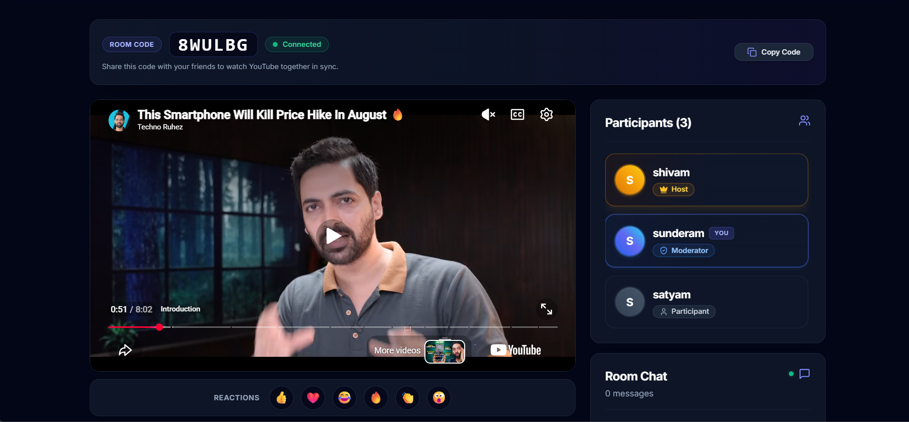
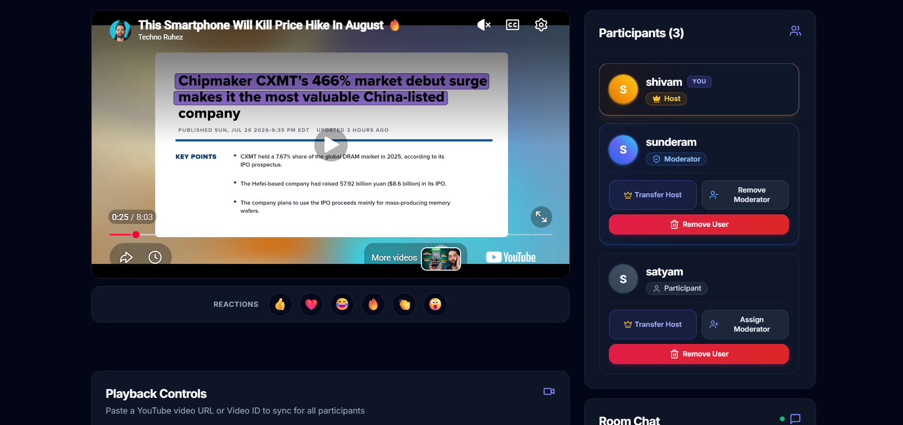
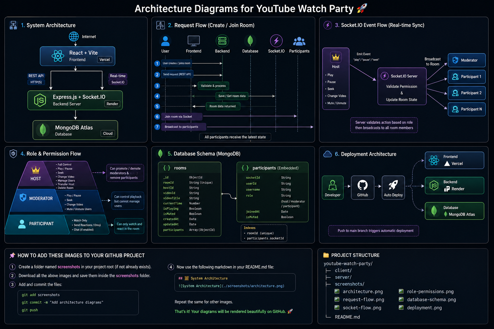

# 🎬 YouTube Watch Party

### Real-Time Multi-User YouTube Synchronization Platform

Watch YouTube videos together with friends in real-time using synchronized playback, role-based permissions, and WebSocket communication.

<p align="center">


</p>

---

## 🌐 Live Demo

### 🚀 Frontend

https://youtube-watch-party-omega.vercel.app

### ⚙️ Backend

https://youtube-watch-party-rf6i.onrender.com

---

## 📖 Project Overview

YouTube Watch Party is a full-stack real-time web application that allows multiple users to watch YouTube videos together in perfect synchronization.

Users can create private rooms, invite participants using a unique room code, synchronize video playback in real-time, assign moderator roles, transfer host permissions, remove participants, and interact using emoji reactions.

The application is built using **React**, **Node.js**, **Express**, **Socket.IO**, and **MongoDB Atlas**, with the frontend deployed on **Vercel** and the backend deployed on **Render**.

---

## ✨ Features

### 🎥 Real-Time Synchronization

- 🔄 Real-time YouTube video synchronization using **Socket.IO**
- ▶️ Synchronized Play, Pause, and Seek controls
- ⏱️ Late joiners automatically sync to the current playback state
- 📺 Supports standard YouTube URLs, short URLs, and video IDs

---

### 👥 Room Management

- 🏠 Create private watch rooms with a unique room code
- 🚪 Join rooms instantly using the room code
- 📋 One-click room code copy
- 👥 Live participant list with real-time updates
- 🟢 Connection status indicator

---

### 👑 Role-Based Permissions

- 👑 Host controls video playback
- 🛡️ Assign and remove Moderator role
- 🔄 Transfer Host privileges to another participant
- ❌ Remove participants from the room
- 🔒 Role-based access control for room management

---

### 😊 Interactive Experience

- ❤️ Emoji reactions during playback
- 🔔 Beautiful toast notifications for important actions
- 📱 Fully responsive design for Desktop, Tablet, and Mobile
- 🎨 Modern dark-themed user interface
- ✨ Smooth animations and hover effects

---

### ⚡ Backend & Infrastructure

- 🌐 RESTful API built with Express.js
- ⚡ Real-time communication using Socket.IO
- 🍃 MongoDB Atlas for database management
- ☁️ Frontend deployed on Vercel
- 🚀 Backend deployed on Render
- 🔐 Environment variable configuration
- 📂 Clean and scalable project architecture

---

# 📸 Application Screenshots

## 🏠 Home Page

<p align="center">
  
</p>

The landing page allows users to create a new watch room or join an existing room using a unique room code.

---

## ➕ Create Room

<p align="center">
  
</p>

Hosts can instantly create a private watch party room and invite others using the generated room code.

---

## 🎬 Watch Room

<p align="center">
  
</p>

The synchronized watch room includes the YouTube player, participant management, reactions, room controls, and real-time synchronization powered by Socket.IO.

---

## 👥 Participants Panel

<p align="center">
  
</p>

Participants are updated in real time. Hosts can assign moderators, transfer host privileges, or remove users directly from the participant panel.

---

# 🛠️ Tech Stack

| Category | Technologies |
|----------|--------------|
| **Frontend** | React.js, Vite, React Router DOM, Axios |
| **Backend** | Node.js, Express.js |
| **Real-Time Communication** | Socket.IO |
| **Database** | MongoDB Atlas, Mongoose |
| **UI & Styling** | Tailwind CSS, Lucide React, React Hot Toast, Sonner |
| **YouTube Integration** | React YouTube, YouTube IFrame API |
| **Deployment** | Vercel (Frontend), Render (Backend) |
| **Version Control** | Git, GitHub |
| **Development Tools** | VS Code, Postman, MongoDB Compass |

---

## 📦 Project Dependencies

### Frontend

- React 18
- Vite
- React Router DOM
- Axios
- Socket.IO Client
- React YouTube
- Lucide React
- React Hot Toast
- Sonner

### Backend

- Node.js
- Express.js
- Socket.IO
- MongoDB Atlas
- Mongoose
- CORS
- dotenv

---

# 📂 Project Structure

```text
youtube-watch-party
│
├── client
│   ├── public
│   ├── src
│   │   ├── assets
│   │   ├── components
│   │   ├── context
│   │   ├── hooks
│   │   ├── pages
│   │   ├── routes
│   │   ├── services
│   │   ├── socket
│   │   ├── utils
│   │   ├── App.jsx
│   │   └── main.jsx
│   └── package.json
│
├── server
│   ├── config
│   ├── controllers
│   ├── middleware
│   ├── models
│   ├── routes
│   ├── socket
│   ├── utils
│   ├── app.js
│   ├── server.js
│   └── package.json
│
├── screenshots
│
├── README.md
│
└── LICENSE
```

---

## 📁 Folder Description

| Folder | Description |
|---------|-------------|
| **client/** | React frontend built with Vite |
| **server/** | Express backend with Socket.IO |
| **controllers/** | Business logic for room operations |
| **routes/** | REST API endpoints |
| **models/** | MongoDB database models |
| **socket/** | WebSocket event handlers and synchronization logic |
| **middleware/** | Logger, error handling, request validation |
| **config/** | Database connection and CORS configuration |
| **screenshots/** | Project screenshots and demo GIF used in README |

---

# 🏗️ System Architecture

```text
                    +------------------------+
                    |       Browser          |
                    |     React + Vite       |
                    +-----------+------------+
                                |
                                |
               REST API          |      Socket.IO
                                |
                                ▼
                    +------------------------+
                    |   Express.js Server    |
                    |  Room Controller/API   |
                    +-----------+------------+
                                |
              +-----------------+-----------------+
              |                                   |
              ▼                                   ▼
     Socket.IO Server                    MongoDB Atlas
(Room Management & Sync)             Room Metadata & Users
```

The application follows a client-server architecture where the React frontend communicates with the Express backend using REST APIs for room management and Socket.IO for real-time synchronization. MongoDB Atlas stores room metadata and participant information.

# 🔄 Application Flow

```text
User Opens Website
        │
        ▼
Create / Join Room
        │
        ▼
Backend Creates / Finds Room
        │
        ▼
Socket.IO Connection Established
        │
        ▼
User Joins Room
        │
        ▼
Participants Receive Update
        │
        ▼
Host Loads YouTube Video
        │
        ▼
Video Broadcast to Everyone
        │
        ▼
Play / Pause / Seek Events
        │
        ▼
Real-Time Synchronization
```

# ⚡ Socket.IO Event Flow

```text
Host
 │
 │ change_video
 ▼
Socket.IO Server
 │
 ├────────────► Participant 1
 │
 ├────────────► Participant 2
 │
 ├────────────► Participant 3
 │
 └────────────► Moderator
```

All playback actions are first validated on the backend before being broadcast to every connected participant in the room.

# 👥 Role-Based Permission Flow

```text
                 HOST
      ┌──────────┼──────────┐
      │          │          │
      ▼          ▼          ▼

 Load Video   Assign Role  Remove User
 Play/Pause   Transfer Host Change Video
 Seek

                │
                ▼

            MODERATOR
      ┌──────────┼─────────┐
      ▼          ▼         ▼

 Play/Pause     Seek     Change Video

                │
                ▼

           PARTICIPANT

        Watch Only
        Emoji Reactions
```

# 🗄️ Database Schema

```text
Room
│
├── roomId
├── hostId
├── videoId
├── currentTime
├── isPlaying
├── participants[]
└── createdAt


Participant

├── socketId
├── username
├── role
└── joinedAt
```
# 🎯 Design Decisions

### Why Socket.IO?

Socket.IO was selected to provide low-latency, bidirectional communication between the client and server, enabling real-time synchronization of video playback across all connected participants.

### Why MongoDB?

MongoDB Atlas stores room information, participant metadata, playback state, and room configuration. Its flexible document model makes it suitable for rapidly evolving real-time applications.

### Why React?

React provides a component-based architecture, making the UI modular, reusable, and easy to maintain.

### Why Express?

Express provides a lightweight backend for REST APIs, room management, and seamless integration with Socket.IO.

# 🚧 Challenges Solved

During development, several real-world challenges were encountered and resolved:

- Fixed synchronization issues caused by delayed YouTube player initialization.
- Implemented state recovery for users refreshing the page without breaking the room.
- Prevented unauthorized playback by enforcing backend role validation.
- Resolved Socket.IO reconnection issues after browser refresh.
- Fixed deployment issues on Render related to MongoDB Atlas DNS resolution.
- Configured Vercel routing to support React Router deep links.
- Ensured newly joined participants automatically synchronize with the current playback state.

# 🏗️ System Architecture

The YouTube Watch Party application follows a real-time client-server architecture. The React frontend communicates with the Express backend using REST APIs for room management and Socket.IO for instant synchronization of video playback, reactions, and participant updates. MongoDB Atlas stores room metadata and playback state, while the application is deployed using Vercel and Render.

<p align="center">
  
</p>

### Architecture Highlights

- ⚛️ React + Vite frontend hosted on **Vercel**
- 🟢 Express.js backend hosted on **Render**
- ⚡ Socket.IO for real-time synchronization
- 🍃 MongoDB Atlas for persistent room data
- 🎥 YouTube IFrame API for synchronized playback
- 🔄 REST APIs for room creation and management